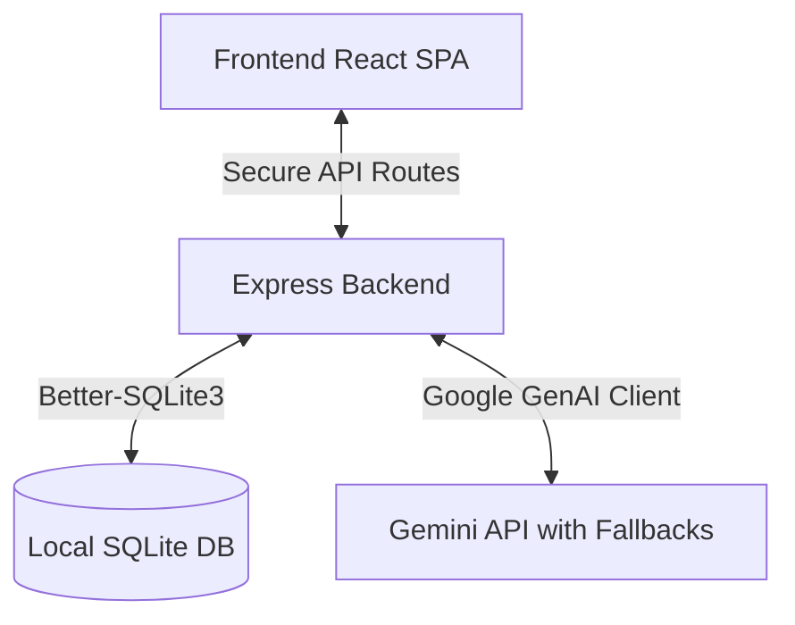

<div align="center">

# Lumina AI — Mental Wellness Intelligence Platform

[](https://nodejs.org/)
[](https://vitejs.dev/)
[](https://react.dev/)

**Lumina** is a structured, AI-powered mental wellness companion and self-reflection companion. Designed with modern aesthetics and interactive features, it helps users track their emotional trends, identify cognitive distortions, manage stress levels, and learn healthier coping behaviors in a secure, local-first environment.

</div>

---

## 🌟 Core Features

- **Therapist-Inspired Dialogue Pattern**: Engages users in deep emotional exploration and reflective listening using validation and cognitive clarification techniques.
- **Advanced Emotion & Stress Analytics**: Automatically extracts and displays metrics such as mood scores, stress levels, situational triggers, and therapeutic focuses.
- **Cognitive Distortion Spotting**: Detects negative thinking patterns (e.g., Catastrophizing, All-or-Nothing Thinking, Personalization) and guides users to notice them gently.
- **Interactive Breathing & Grounding Tool**: Visualizes 4-7-8 breathing cycles to help users step out of high-stress or overwhelming situations.
- **AI-Powered Insights Reflection**: Provides weekly personalized patterns analysis and reflections based on recent conversation trends.
- **Secure Backend Design**: Routes Gemini AI requests via a local Express server to keep API secrets fully protected.

---

## 🏗️ Architecture & Flow

Lumina utilizes an integrated fullstack setup designed to run seamlessly on a local machine.



- **Frontend**: A highly polished SPA built using React 19, Tailwind CSS, Lucide icons, and Framer Motion for smooth micro-animations and custom transitions.
- **Backend API**: An Express server configured to handle local API routes, database integrations, and secure LLM calls.
- **Local Persistence**: Database states are stored in a local SQLite file (`lumina.db`) ensuring data privacy and offline support.

---

## 🛠️ Tech Stack

- **Core Framework**: React 19, TypeScript 5.8
- **Build Tool**: Vite 6
- **Styling**: Tailwind CSS 4
- **Database**: SQLite (via `better-sqlite3`)
- **API Server**: Express 4
- **AI Integration**: `@google/genai` (SDK with built-in model fallbacks)
- **Animations**: `framer-motion` & `motion`

---

## 🚀 Running Locally

Follow these quick steps to set up and run Lumina on your local machine:

### Prerequisites
- [Node.js](https://nodejs.org/) (Version 18 or higher recommended)

### 1. Install Dependencies
Clone the repository and run the installation command:
```bash
npm install
```

### 2. Configure Environment Variables
Create a `.env` file in the root directory and add your Gemini API Key:
```env
GEMINI_API_KEY="YOUR_GEMINI_API_KEY"
PORT=3000
```
*(You can also use `.env.local` or copy from `.env.example`.)*

### 3. Start Development Server
Launch the application:
```bash
npm run dev
```
The application will launch and be accessible at **`http://localhost:3000`**.

---

## 🔒 Security & Data Privacy

Lumina prioritizes user privacy. All user chat histories, session logs, and personal statistics remain encrypted/stored locally inside `lumina.db` on your hard drive. No chat data is shared with third-party tracking services or external cloud databases except for processing AI responses via the official Google Gemini API.

---
